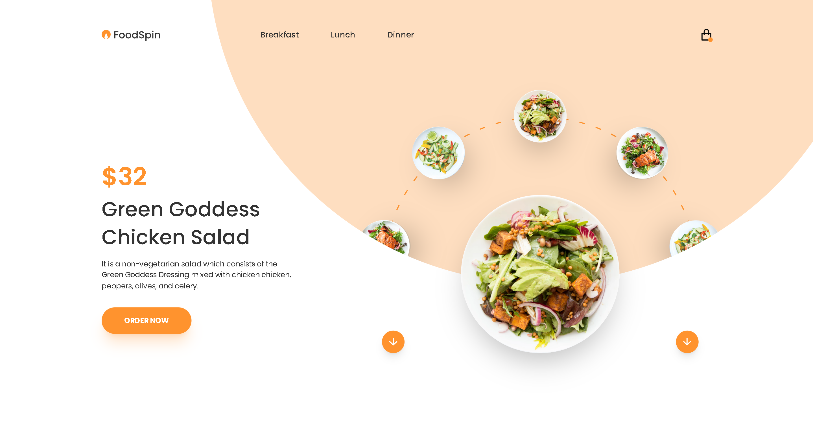

# Food Interaction Carousel

This captivating landing page serves as a gateway to a food e-commerce website, presenting a captivating spin carousel that showcases a list of delectable offerings. This dynamic presentation is complemented by additional information elegantly displayed alongside the carousel, creating an immersive and engaging user experience. Furthermore, the page is adorned with a stynning animation and responsiveness that add an extra layer of enhancement to the overall user experience.

### Screenshot

### Figma Design by

- **Designer** - Ismail El Azizi
- **Figma Profile** - https://www.figma.com/@ismail
- **Design Link** - https://www.figma.com/community/file/825851668856380188
